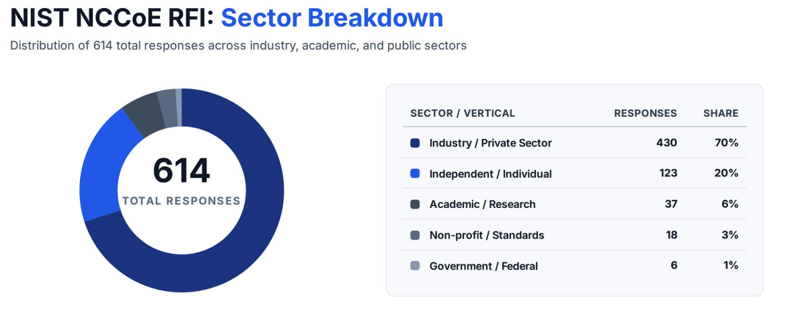

.. note::

   **AI Use Disclaimer**

   This manuscript was edited with the assistance of Gemini, developed by Google. Gemini was used to refine language, review and summarize comments, improve
   clarity, and enhance readability in accordance with the authors’ instructions. All content, scientific claims, and conclusions have been reviewed and verified
   by the authors to ensure accuracy and originality.

Summary of Comments on the Concept Paper
========================================

In February 2026, NIST published the `Accelerating Adoption of Software and Agentic AI Identity and Authorization concept
paper <https://www.nccoe.nist.gov/sites/default/files/2026-02/accelerating-the-adoption-of-software-and-ai-agent-identity-and-authorization-concept-paper.pdf>`__.
The paper requested input from stakeholders on how to design and deliver a project that would drive meaningful outcomes for securing the emerging agentic
ecosystem. The engagement was substantial, with over 600 responses received. The graph below provides a high-level breakdown of the types of organizations who
provided comments.

This document summarizes the key observations and feedback identified through the public comments received in response to the Concept Paper as well as through
discussion with stakeholders in the Agentic AI ecosystem. This summary is intended to aid in building consensus around the complex topics, challenges, and
potential solutions found in the agentic ecosystem.

|image1|

These observations will also inform the development of a future NCCoE project focused on practical, standards-based approaches for establishing trustworthy
identity, authorization, accountability, and governance mechanisms for AI agents. As a next step, the NCCoE intends to release a draft project description which
will ask for feedback on a proposed scope, use cases, architecture, and standards to be used for this project.

.. raw:: html

   

     5 sections — click a section to expand.
     <button type="button" id="expand-collapse-all" aria-describedby="pram-dropdown-hint">
       Expand All
     </button>
   

.. dropdown:: **General Feedback** *Broad themes identified in the public comments.*
   :name: general-feedback
   :class-container: pram-dropdown pram-dropdown-teal
   :class-title: pram-dropdown-title
   :class-body: pram-dropdown-body
   :chevron: right-down

   .. rubric:: Build Off Existing Foundations
      :name: build-off-existing-foundations

   The comments highlighted two broad perspectives on the application of standards to the emerging agentic ecosystem:

   1) Evolutionary – build off the foundations of existing standards and protocols

   2) Revolutionary – establish a new agentic specific standards infrastructure to support the future

   The overwhelming majority of commenters favored an evolutionary approach (building off existing standards) over a revolutionary approach (starting from
   scratch). Commenters caution that throwing away decades of hardened identity infrastructure introduces severe adoption barriers and immediate security risks. It
   also introduces years of potential standardization processes that may not maintain pace with the emerging technology, leaving implementers with ad hoc best
   practices during critical periods of implementation.

      “...supports the concept paper’s premise that existing identity standards should be applied to agentic systems rather than creating a parallel identity
      stack. The submission focuses on enterprise agents that connect to many tools and argues for strengthening implementation and interoperability around
      existing standards, particularly MCP and OAuth-based ecosystems.”
      
      -- Concept Paper Commenter

   Those favoring a revolutionary approach pointed out the new paradigms of agentic systems—probabilistic and adaptive—as problematic for existing identification,
   authentication, and authorization structures, which are built on deterministic approaches. While the probabilistic nature of agents is a valid concern, it is
   unclear that the paradigms introduced by agentic systems are wholly incompatible with the existing standards.

   The concept paper favored an evolutionary approach. Based on the feedback, the NCCoE project will test the hypothesis that existing standards, along with
   extensions, enhancements, and profiles, can provide the foundation for managing agentic identity and authorization. Any critical gaps in existing standards, as
   identified by respondents, or through this work, will be provided as feedback to the standards and agentic AI communities.

   .. rubric:: Agentic Scale
      :name: agentic-scale

   While respondents did feel an evolutionary approach to standards was necessary, they also acknowledged that the growth and scale of agentic use will be a
   cross-cutting challenge to how those standards are implemented. Commenters noted both the sheer number of agents that might exist, internal or external to an
   enterprise, in addition their ephemeral nature compounds the number of unique identities and credentials to be issued, managed, and audited. Furthermore, agents
   may be used for any number of actions or tasks, and best practices might dictate that these tasks are segregated or delegated to subagents, each given the least
   entitlements needed to complete an action. While such architectures would promote least privilege, separation of duties and zero trust principles, it also
   increases agentic scale and the complexity associated with effectively managing the agents.

   Overall, commenters concluded that any AI Agent governance solution will need to grapple with the potential scale both in terms of the total number of AI Agents
   that will be instantiated as well as in the diversity of tasks for which AI Agents will be employed. Recommendations focused on breaking down operational
   bottlenecks that may be introduced by authorization systems, implementing key management techniques to address complex scaling challenges, deploying
   independently verifiable tokens or credentials to minimize centralized calls to verification servers where latency can be introduced, and enabling robust
   auditing and traceability.

   .. rubric:: Agentic Deployment Models
      :name: agentic-deployment-models

   Respondents highlighted that the ability to implement identity and authorization standards and best practices differs based on the agentic deployment model.
   Three different models were mentioned, each with differing levels of agentic ownership and control:

   - Enterprise-owned agents where the agent is deployed and managed within a controlled enterprise environment and operated by organizationally controlled
     individuals, systems, or processes. For example, agents that write, audit, and deploy code within the enterprise. In this scenario, the agent identity,
     authorization, and harness are established and controlled through enterprise governance. The enterprise also controls the identity and authorization of
     users, and the processes and contexts in which agents can be instantiated and instructed.

   - Enterprise-owned agents that are offered as an external facing service and accept prompts and instructions from third parties or consumers. For example, a
     customer service agent that can help consumers take action or resolve issues with enterprise service offerings. These agents are deployed within an
     enterprise harness and subject to enterprise identity and authorization controls, however they differ from the first model in that their prompt and
     instructions come from individuals, organizations, or other agents that are outside the enterprise. In some cases, these agents may have more entitlements
     and rights than the identity of the entity providing the prompt or instructions.

   - Externally-owned agents who interact with enterprise services, with or without a trust framework. For example, a consumer-owned agent that is given access to
     an individual’s financial accounts to help them better manage their finances. These agents are owned and controlled by a third party (this could be a
     service provider or an individual) and enterprise influence on their identity and authorization is limited. The agent may have its own unique identity but
     may also be given an identity or static credential of an individual or organization. These agents may leverage enterprise managed API or accounts but may
     also “screen scrape” or look like a user coming through a browser. Broadly, there is recognition that for externally owned agent scenarios, the “secure
     path,” will also need to be the “easy path,” or anti-patterns such as impersonation and credential sharing will continue to proliferate.

   Respondents also noted that the underlying agentic infrastructure will impact how agents are identified and authorized. Many stated that cloud deployments will
   offer greater security services that can take advantage of hardware roots of trust and natively segmented or containerized architectures. Locally deployed
   agents were also recognized as commonly used, but respondents expressed concern over the lack of local security controls available to the enterprise and the
   common pattern of giving agents user or even local admin rights to complete tasks. The challenge of shadow AI was also mentioned in scenarios where locally
   deployed agents are operating inside of an enterprise, but without proper identification and authorization controls.

.. dropdown:: **Feedback on NCCoE Project Scope** *Comments on the proposed project scope.*
   :name: feedback-on-nccoe-project-scope
   :class-container: pram-dropdown pram-dropdown-blue
   :class-title: pram-dropdown-title
   :class-body: pram-dropdown-body
   :chevron: right-down

   The NCCoE concept paper proposed a notional scope for a future NCCoE project. While many respondents agreed with this initial scoping, many others emphasized
   areas of concern they felt should be in scope. The following areas were identified by commenters as key challenges that, if addressed, would enhance the value
   and impact of any implementation.

   - **Multi-Agent Scenarios**: Many respondents desired that any NIST project address use cases and architectures that involve multi-agent implementations.
     Whether through multiple “primary” agents interacting to achieve a defined outcome or specialized sub-agents executing decomposed tasks, or agents from
     one organization “talking to” those in another, commenters expressed interest in seeing examples of how agent-to-agent interactions can occur and be
     effectively secured through the use of standards and protocols. Notably, many participants wanted a clear illustration of how entitlements and
     authorizations flow through these enterprise architectures, including decisions made across agent and organizational boundaries.

   - **Crossing Trust Boundaries**: A large volume of participants identified that agentic workflows are likely to cross trust boundaries. Whether they are
     communicating enterprise-to-enterprise, requesting data from across environments, or transitioning from one service to another, agents must have a way of
     establishing trust as they cross boundaries. Respondents noted that as these boundaries are crossed, information such as user and agent identity, agent
     authorizations, cryptographic intent and consent, as well as relevant context and metadata, may need to travel with the agent to support authorization
     decisions.

   - **Externally Owned Consumer Agents**: While the NCCoE concept paper focused on enterprise agentic deployments, many respondents felt that externally owned
     consumer agentic use-cases were equally or more important. Commenters highlighted that current tools and platforms already allow consumers to deploy their
     own agents, however many consumer-facing services are not yet equipped to provide dedicated agentic service channels. Moreover, consumer-facing services
     struggle to distinguish between human and agentic interactions, a challenge that is exacerbated when a human allows their agent to impersonate them by
     giving the agent access to user credentials. Respondents highlighted the need to address identification, authentication and authorization for use-cases
     where consumers want to bring their own agent.

   The NCCoE will take the above feedback into consideration and release more detailed information on our updated scope when we publish our draft project
   description paper.

.. dropdown:: **Technical Considerations for Identity and Authorization** *Technical themes raised by commenters.*
   :name: technical-considerations-for-identity-and-authorization
   :class-container: pram-dropdown pram-dropdown-teal
   :class-title: pram-dropdown-title
   :class-body: pram-dropdown-body
   :chevron: right-down

   .. rubric:: Agentic Identity
      :name: agentic-identity

   Commenters noted that agentic identity should be treated as more than a label, describing it as a combination of the agent’s workload or service identity, its
   operating instance, the human or organization that authorized it, and the specific authority it holds at a given moment. Respondents also called out the
   importance of being able to verify that the agent, its runtime environment, and—where relevant—its sponsoring human or organizational principal are genuinely
   the entities they claim to be.

      “There are a number of critical challenges here that need to be addressed, including:

      How to enable online service providers to differentiate between a human, an agent that has been authorized by a human to perform a task for them, and an
      agent or bot that is claiming to have such authorization – but does not?...

      How to assign an easily verifiable identity to each agent – knowing that many agents might be ephemeral, and only be created to support a specific task for
      a short period of time?” 
      
      -- Concept Paper Commenter

   A central theme to meeting these requirements was the ability to distinguish agents from humans. Almost everyone expressed the need for agents to have distinct,
   verifiable non-human identities, authenticated through mechanisms such as workload credentials, cryptographic signatures, mutual authentication, or attestation.

   It’s important to note, that while there was near unanimity on the concept of identifying agents, there was no consensus on the exact means for doing this—with
   splits on technical approaches, standards, trust models, and concepts (e.g., centralized vs. decentralized models). Since many of these implementation specifics
   will vary by use-case, NIST will work with collaborators in any future build to explore implementation patterns based on the context, constraints, and
   considerations related to the specific use cases executed as part of the project. As with any digital identity challenge, interoperability is essential, but
   there is unlikely to be a single “one-size-fits-all” approach that would satisfy every potential deployment.

   .. rubric:: Persistence and Ephemerality
     :name: persistence-and-ephemerality

   Identification and authentication of AI agents can be executed at different layers and in completely different ways based on how they interact with enterprise
   systems. The public feedback received by NIST highlighted a critical architectural debate regarding the lifetime and durability of an agent’s identity. Rather
   than treating this as a binary choice—forcing an identity to be entirely persistent or entirely short-lived—commenters overwhelmingly pointed out that a modern
   agentic security framework requires the ability to create persistent trust anchors while supporting ephemeral, tightly scoped credentials, entitlements, and
   authorizations.

      "The paper's discussion of ephemeral versus fixed agent identity presents a false binary. The identity anchor should be stable, tied to the software
      artifact and organizational boundary that produced the agent. The credential expressing that identity should be short-lived, bound to the anchor via a
      confirmation claim, and independently revocable." 
      
      -- Concept Paper Commenter

   .. rubric:: Trust Anchors
     :name: trust-anchors

   There was a broad consensus across submissions that any secure agentic deployment must rely on stable, long-lived "roots of trust" or "trust anchors." These
   persistent anchors should not be tied to an individual, dynamic agent instance, but must instead be cryptographically bound to the foundational layers that
   produced and housed the agent.

   Commenters noted that persistent anchors are required to provide a stable baseline for several desired security functions:

   -  **Infrastructure and Hardware Binding:** Tying the deployment environment to hardware-rooted trust signals (such as TPMs, secure enclaves, or organizational
      cryptographic keys).

   -  **Behavioral Analysis and Telemetry:** Allowing enterprise risk engines to perform long-term behavioral profiling, baseline anomaly detection, and reputation
      scoring of specific agentic services over time.

   -  **Structured System Metadata:** Attaching immutable, long-lived metadata—such as the model family, software bill of materials (SBOM), and organizational
      ownership boundaries—to inform continuous access policies.

   .. rubric:: Ephemeral Access
     :name: ephemeral-access

   Conversely, commenters strongly advocated for the use of highly ephemeral identifiers, tokens, or credentials when an agent is executing tasks within a
   workflow. Because AI agents can be instantiated dynamically to perform specialized, short-lived tasks, granting them long-lived API keys or persistent
   user-level entitlements introduces severe security risks, such as token compromise or unauthorized background execution.

   Instead, the credential expressing the agent's identity can be ephemeral but bound to the stable trust anchor via a proof-of-possession or similar capability.
   These ephemeral credentials or tokens should feature:

   -  **Validity:** Tokens that automatically expire immediately upon the completion (or timeout) of a specific, decomposed sub-task.

   -  **Attenuation:** Credentials that explicitly narrow their permission scope as they pass down a delegation chain, ensuring that a sub-agent never inherits
      more access than required for its immediate, transient function.

   -  **Revocability**: The capability to request to revoke a specific operational token without disrupting the persistent identity anchor or freezing other
      co-existing agent workflows.

   .. rubric:: Task Scoped & Contextual Authorization
     :name: task-scoped-and-contextual-authorization

   There is a strong consensus that identity models will need to shift to more dynamic, context aware methods of managing authorization decisions. Relying on
   static entitlements or super-sets of inherited entitlements is insufficient to address the probabilistic nature of agents as they decompose and execute the
   tasks they are assigned. Further, there are concerns that agents will aggregate authorizations as task chains are executed, resulting in excessive access rights
   and the potential for either malicious or inadvertent privilege escalation due to reduced separation of duty protections. Since these agent workflows can cross
   organizational and security boundaries, the mechanisms for authorization and authentication need to be coordinated.

      "Zero-trust authorization requires continuous evaluation at the moment of action (not just login), using Fine-Grained Authorization (FGA) for every tool
      call and API interaction. Scope attenuation mandates that each agent in a delegation chain has fewer permissions than its predecessor. Context Grounding
      requires every agent request to carry a Current Task metadata tag to detect and prevent intent drift."
      
      -- Concept Paper Commenter

   Commenters strongly advocated for a continuous authorization model built on Zero Trust principles that make contextual authorization decisions at run time.
   Instead of authorizing the agent once, when the user authenticates, security frameworks must evaluate authorization at the task level and subsequently attenuate
   authorizations as agents and sub-agents execute chained tasks. Overall, respondents desired to see a shift to models that supported more granular authorization,
   just-in-time provisioning or entitlements, and enforcement of least privilege at the lowest level. Such an approach limits the blast-radius of a potentially
   compromised or malicious agent and provides the ability to manage access based on what needs to be done by agents rather than relying on inherited entitlements
   of users or parent agents.

   .. rubric:: Cryptographic Signed Intent
     :name: cryptographic-signed-intent

   Cryptographic intent—essentially having some form of the user’s expected outcomes signed by a trusted key—is seen by our commenters as a necessity, particularly
   for the advancement of consumer facing or cross boundary use cases. It provides an integrity and tamper resistant statement of what the agent is supposed to be
   achieving that can be processed by authorization systems to make access decisions. Several protocols have been advanced on this topic, however no clear
   consensus exists on how to implement through a broadly accepted standard.

      "The core argument is that current authorization frameworks answer who is acting but not what bounded authority is being exercised for a specific action,
      creating an intent dimension that has no standard representation." 
      
      -- Concept Paper Commenter

   While many see intent as a necessary component for authorization, auditability, non-repudiation and legal liability, there are associated challenges with this
   concept. Notably, the term “intent” is not fully defined and introduces concerns about how the intent statement will be formulated, structured, and parsed. A
   major concern emerges around privacy as some techniques may leave room for unnecessary, possibly sensitive information to be communicated across agents,
   environments, and services. Other approaches advocate for a signed mandate or approved “flight plan” that removes unnecessary information but carries forward a
   decomposed and user approved task list that the agent can present to different access enforcement and decision points.

   There are also concerns with any approach being broadly scalable as these would likely rely on either 1) plain language intent statements that would need to be
   independently evaluated by a probabilistic engine (see our section on probabilistic authorization below) or 2) an ontology that would allow for deterministic
   parsing but would require standardization; a process, that in and of itself would likely introduce scaling challenges.

   This is an area that will require further engagement and standardization efforts—but will likely be a notable part of enterprise use cases in the future and a
   potentially critical component for consumer facing use cases such as online retail and commerce.

   .. rubric:: Delegation and Accountability 
     :name: delegation-and-accountability

   Many commenters emphasized that AI agents derive authority from human or organizational principles and therefore require mechanisms that preserve authorization
   context across service boundaries and through delegation chains. Delegation is an existing challenge in today’s identity infrastructure and will be exacerbated
   by the scale and complexity of agentic deployments. Several submissions noted that authorization decisions become increasingly difficult to evaluate as rights
   are delegated across multiple hops (which may be human to agent or agent to agent) and across organizational boundaries. There was clear concern that agentic
   ecosystems could create accountability gaps if downstream actions cannot be reliably connected back through the call chain to the responsible human or
   institution.

      “Delegation is the foundational enabler of agent utility in the enterprise. Standardized delegation allows agents to act on behalf of human principals
      across application boundaries with explicit user intent, eliminating the need to expose long-lived credentials or grant broad ambient privileges.”
      
      -- Concept Paper Commenter

   Commenters noted that to support legal liability and non-repudiation, agentic identities and delegated authorities should remain cryptographically traceable to
   the entity originating the agentic instruction, even as actions pass through multiple agents, tools, services, or organizations. As previously discussed,
   cryptographically signed intent or flight plans provide some capacity to address these issues by binding a user to their directed actions through a signed
   statement. Known proposals seek to address this issue through signed tokens that captures and conveys delegation information, authorization constraints, and
   scope attenuation across organizational boundaries, are then consumed by resource servers, MCP servers, and policy enforcement points while preserving the
   delegation chain.

   .. rubric:: Deterministic v. Probabilistic Authorization approaches
     :name: deterministic-vs-probabilistic-authorization-approaches

   Traditionally, authorization relies on deterministic policy enforcement mechanisms to manage granular access to resources, data, and APIs. Agents, however, are
   inherently probabilistic, they are executing tasks, and performing actions based on how their reasoning model decomposes a user’s intent and responding to new
   context, conditions, and barriers they encounter.

      “AI agents interpret intent probabilistically, adapt to new context, and may take actions with limited human supervision. That shift from deterministic
      automation to adaptive decision-and-action loops is the central architectural distinction.”
      
      -- Concept Paper Commenter

   Comments NIST received surfaced this tension with some respondents reflecting that probabilistic approaches to evaluating access needs to be layered into
   authorization schemes to account for the fluidity with which agents will operate. Commentators emphasized probabilistic approaches’ efficacy in evaluating the
   behavior of agents and identifying anomalous activity as part of the criteria used by policy enforcement points to make decisions.

   Alternatively, there was very strong opposition to leveraging LLMs and other probabilistic mechanisms as the primary or sole arbiter of authorization decisions.
   Many also cited the unresolved threat of direct and indirect prompt injections, which could lead to unexpected or malicious model behavior resulting in
   inherently unreliable authorization decisions.

   In the end, consensus pointed to deterministic policy and policy enforcement being essential to security, with probabilistic capabilities potentially being
   layered in to provide context to authorization decisions. This provides both the strict enforcement capabilities required to protect sensitive information while
   enabling more flexible mechanisms for the application of granular, context informed decisions.

   
   .. rubric:: Control Plane vs. Data Plane
      :name: control-plane-vs-data-plane

   The feedback provided in the public comments highlighted that securing and trusting AI agents is fundamentally challenged by a lack of separation between their
   data and control layers. Unlike traditional systems, which strictly separate processing instructions from user input to avoid security weaknesses (e.g. SQL
   Injection), LLMs ingest both system instructions and user prompts as a single stream of tokens through a single channel. Because the model cannot inherently
   distinguish between the two, user inputs (the data layer) can easily masquerade as, and override, system instruction (the control layer).

      "The submission proposes a distinct AI Execution Control Plane as an infrastructure layer separate from agent reasoning, policy evaluation, and
      orchestration. The core thesis is that the reasoning system cannot also be the authorizing system... creating the need for an infrastructure layer that
      separates reasoning authority from execution authority and enforces human-in-the-loop as a hard blocking state rather than a procedural step." 
      
      -- Concept Paper Commenter

   Commenters emphasized that a robust security architecture must provide compensating controls to mitigate risks like prompt injection and unauthorized privilege
   escalation. There are several proposed approaches to this, and a common suggestion was architectural separation of components using a “governance layer” or
   “gateway” to evaluate and enforce requests coming from agents based on a defined set of policies and transactional information. This separation is expected to
   occur at multiple points in the architecture—from the initial user interaction and prompt processing to agentic tool and data calls, to cross boundary requests.
   Regardless of the specific proposed approach, there was consensus that a logically separate agent governance component was essential to securing workflows and
   effectively managing authorization consistent with Zero Trust principles. Many commenters further suggested that such control planes need to make use of
   standardized policy language to enable more consistent authorization at run-time and across organizational boundaries.

   
   .. rubric:: Direct and Indirect Prompt Injection
      :name: direct-and-indirect-prompt-injection

   As a result of the lack of separation between the data and control layers, many respondents highlighted the risk of direct and indirect prompt injections.
   Specifically, the risk that as agents call external tools and resources, there is an increased likelihood that the agent will ingest untrusted data into its
   context window.

      “Direct and indirect prompt injections both exploit the fact that prompts shape behavior, and that agents may act on untrusted language inputs, retrieved
      content, or tool outputs.” 
      
      -- Concept Paper Commenter

   While the NCCoE concept paper explicitly left out the notion of researching guardrails for agentic reasoning models, commentators noted that agentic
   authorization policy should change if a prompt injection is suspected and might even need to change whenever an agent operates on untrusted data, which could
   contain a prompt injection. As mentioned above, respondents also mentioned the need for a governance layer that can monitor and sanitize agentic reasoning model
   inputs as well as the need to ensure that audit logs contain information about which tools and resources an agent called.

   .. rubric:: Metadata as a critical trust signal
     :name: metadata-as-a-critical-trust-signal

   Public feedback strongly suggests that NIST frame AI agent metadata not as a flat log file, but as a layered, cryptographically bound schema that isolates the
   underlying model substrate, the execution runtime, and operational boundaries. Commenters emphasized that metadata serves as the foundational "trust telemetry"
   required for continuous authorization engines to evaluate risk at runtime.

      "Agent identity metadata must extend beyond technical identifiers. The working group recommends that a minimum viable agent identity record include: Model
      version and provenance (who built and deployed the agent), Operating policy context (which authorization policy governed its deployment), Lineage in
      multi-agent pipelines (which parent agent spawned this agent), Human principal binding (which human account authorized deployment)." 
      
      -- Concept Paper Commenter

   Commenters suggest that metadata in the following areas would be useful:

   -  **Core System & Identity Integrity:** Verifies the identity of the agent, tracks its chain of authority, and ensures the underlying reasoning engine has not
      been altered.

   -  **Secure Execution Infrastructure:** Leverages hardware-rooted trust signals to prove that the hosting environment is secure, isolated, and safe from replay
      attacks.

   -  **Operational Boundaries & Capability Controls:** Enforces real-time "least privilege" restrictions by defining what external tools the agent can call and
      bounding its autonomous footprint.

   -  **Data Protection & Compliance Audit:** Governs how sensitive data is handled in alignment with regulatory standards and maintains an unalterable trail for
      forensics.

   While many commenters highlighted that metadata would be a critical part of an agentic trust framework, how and when metadata is conveyed is still an open topic
   of debate. Some commenters noted that elements of metadata will need to be incorporated into an identity or access token, while others noted that additional
   metadata may best be exposed as a service which can be queried at runtime. Standards such as Client ID Metadata (CIMD) were referenced to help support this for
   critical tasks such as client registration.

   The additional metadata requirements highlighted by respondents indicate the need for protocol extensions and/or profiles. Extensions and profiles are essential
   because metadata only supports interoperability and trust when the parties interpret the same fields, claims, capabilities, and constraints in the same way.
   Standard bodies within the agentic ecosystem will need to develop these extensions and profiles for their relevant agentic protocols (e.g., MCP, A2A, OAuth,
   WIMSE/SPIFFE, VC/DID, and SCITT) to ensure that metadata does not become another source of ambiguity, spoofing, or policy drift.

   .. rubric:: Auditability beyond action logging
     :name: auditability-beyond-action-logging

   A recurring theme across submissions was that traditional audit logs capture what happened but often fail to capture why an action occurred, what authority
   governed it, what information influenced the decision, or whether alternative actions were considered.

      “It is not enough to know that an action occurred. It is imperative to show what request was evaluated, what decision was returned, what identities and
      delegations were relevant [and] whether an approval occurred.” 
      
      -- Concept Paper Commenter

   Many respondents proposed enhanced audit mechanisms incorporating delegation chains, policy decisions, intent records, execution evidence, provenance metadata,
   workflow context, or behavioral histories. Several submissions emphasized tamper-evident logging, cryptographic receipts, verifiable evidence chains, and
   structured audit artifacts.

   Collectively, the comments suggest that agent governance may require richer evidence models than those traditionally used for human users or software services,
   which would include both agentic actions and the context in which the agent was operating.

   .. rubric:: Privacy 
     :name: privacy

   NIST’s concept paper focused primarily on gaining insights into the security concerns associated with agentic deployments. However, privacy remains a paramount
   priority for NIST in the implementation of AI systems and agentic tools. Commenters seemed to agree, with many highlighting key privacy concerns that—if
   realized—could actively erode trust in agentic systems and expose users and organizations to risk, including the exposure of highly sensitive information. While
   many issues were called out, a few overarching concerns surfaced: Loss of Anonymity, User Profiling, Data Leakage, and Overcollection.

   **Loss of Anonymity & User Profiling**

   Unlike ordinary software, an agent does not merely collect inputs or present choices; it can interpret goals, infer preferences, remember sensitive facts, call
   tools, search across contexts, and act on the user’s behalf. When coupled with cryptographically bound and potentially static human-user IDs transiting multiple
   services and platforms, the result could be the profiling, tracking, and identification of human users through the actions of their agents. It can also result
   in the exposure of sensitive information linked to the user—such as personal health information—without their knowledge or awareness. While the privacy impact
   of identification practices will change based on the context of the transaction—for example enterprise interaction versus consumer interactions—risk based
   approaches need to be considered to enable the balancing of security, accountability, non-repudiation, with privacy preserving outcomes. Many commenters noted
   the potential value of zero-knowledge proofs and privacy enhancing technologies to ultimately address identification, tracking, and profiling concerns for
   consumer-facing applications.

      “NIST should prioritize a framework that favors verifiable attribution using privacy-preserving cryptographic proofs, over persistent, linkable identity to
      balance operational control with user privacy.”

      -- Concept Paper Commenter

   **Data Leakage & Overcollection**

   While not the same, data leakage and overcollection go hand in hand. When systems aggregate unnecessary data, they also create potential exposure points where
   data can be accessed by unauthorized end-points, users, or agents. Many commenters noted that agents will create new vectors for both leakage and overcollection
   due to the limited separations that exist between the data and control planes, the potential sensitivity of prompts and context, and the potential risks
   associated with the accumulation of entitlements.

   Of particular concern—commenters called out the breadth and depth of potentially sensitive data that could land in logs related to agentic transactions as well
   as the potential risks associated with failing to constrain agentic actions based on the users intent and desired outcomes. Commenters also pointed to the
   inclusion of sensitive data in context and prompt data being passed by agents to other agents, external LLMs, and external API services and highlighted the need
   for strict data governance and data protection practices at the attribute level to prevent overcollection and exposure in cross domain and multi-agent
   scenarios.

   Overall, commenters felt that data minimization priorities and preserving sensitive user information within agentic systems will require the application of
   deliberate technical controls and cannot be enforced purely by policy mechanisms. Respondents felt that users will need understandable configuration choices and
   clear consent mechanisms and enterprises will need enforceable defaults, scoped delegation, and visibility into consent state as agents move across sessions,
   tools, data sources, and downstream services. Also noted was the need to strike a balance between the need for identity, authorization and auditability, with
   the desired privacy outcomes.

   .. rubric:: User Experience
     :name: user-experience

   As AI transitions from chat bots to autonomous agents capable of chaining tasks and exercising delegated access, the human role fundamentally shifts from direct
   operator to agent overseer. Commenters noted that user experience plays a foundational role in ensuring that humans can confidently consent to, manage, and
   maintain control over agentic actions.

   **Consent Fatigue**

   Many commenters stressed the need for Human-in-the-Loop (HITL) safeguards in agentic systems to ensure accountability and prevent harmful autonomous actions.
   However, constantly requiring human approval for routine tasks—such as accessing new data sources or tools—introduces a severe risk of consent fatigue.

      “Consent Fatigue: At machine speed, asking for human approval for every action is impossible. Asking for end-user approval to connect agents with new data
      sources leads to users blindly approving any new prompt.”
      
      -- Concept Paper Commenter

   Commenters recommended a risk-based framework that reserves HITL interactions solely for high-impact, high-risk actions. Otherwise, users overwhelmed by prompts
   may become habituated to thoughtlessly approving access requests, undermining the non-repudiation and accountability that HITL was meant to provide.

   **Lack of Transparency & Explainability**

   In agentic architectures, “anti-patterns” extend beyond misleading buttons or confusing settings. User interactions are conversational in nature, and complex
   processes—such as task decomposition, back-end tool calls, and autonomous execution—can be exceptionally challenging for users to understand. As identified by
   commenters, this creates scenarios where end-users may not understand the impacts of the agentic actions they are instantiating or if an agent will execute
   in-line with their desired intent. These challenges are important because agentic AI can —intentionally or unintentionally—corrupt user intent while appearing
   to serve it. The central risk is that agentic opacity, unclear model reasoning, and delegated authority create scenarios where the user’s goals, choices, or
   actions result in outcomes beyond their meaningful control or understanding.

   Respondents mentioned that these risks require treating agentic systems as fiduciary-like interfaces of trust. Several commenters pointed to the need for
   standardized, human readable, and structured statements generated by agents and their underlying LLM that clearly explains to users what authorities are needed
   to execute a transaction and why. Others highlighted the value of inspectable logs and “flight plans” to enable both run-time and post transaction evaluations
   of intent and outcome.

.. dropdown:: **Relevant Standards** *Standards and specifications identified by commenters.*
   :name: relevant-standards
   :class-container: pram-dropdown pram-dropdown-blue
   :class-title: pram-dropdown-title
   :class-body: pram-dropdown-body
   :chevron: right-down

   Agentic AI identity is emerging as a **compositional standards stack**, not a single standard. Commenters noted that existing specifications provide an
   important starting point for enabling agentic use-cases and strongly advocated for reuse, extensions, and profiles, rather than developing completely new
   standards. The following section provides an overview of many of the standards identified by public commenters. This list is not exhaustive but is meant to
   illustrate the breadth and diversity of standards emerging in this space. As part of the next phase of NIST’s work, standards will be evaluated based on the
   selected use cases and integrated into a proposed conceptual and reference architecture.  

   **NOTE: The standards listed here are in various states of maturity—some are complete and adopted,  others are unofficial drafts, works-in-progress, or early
   proposals. The content here is an attempt to reflect feedback from the public comment period. Inclusion or omission in this document of any particular draft or
   standard should not be taken as endorsement or rejection**.   

   **Conceptual Models**. The IETF `AI Agent Authentication and Authorization <https://datatracker.ietf.org/doc/draft-ietf-wimse-aims/00/>`__ draft introduces the
   **Agent Identity Management System (AIMS)** as an emerging  conceptual model for establishing, maintaining, and evaluating the identity and permissions of an
   agent workload, and organizes `WIMSE <https://datatracker.ietf.org/wg/wimse/documents/>`__,
   `SPIFFE/SPIRE <https://spiffe.io/docs/latest/spiffe-about/overview/>`__, `OAuth 2.0 <https://datatracker.ietf.org/doc/rfc6749/>`__, OpenID `Shared
   Signals <https://openid.net/wg/sharedsignals/specifications/>`__, `AuthZEN <https://openid.net/wg/authzen/specifications/>`__, and `Supply Chain Integrity,
   Transparency, and Trust (SCITT) <https://datatracker.ietf.org/group/scitt/documents/>`__ into a deployable agent identity stack. 

   **Workload identification.** The IETF `WIMSE <https://datatracker.ietf.org/wg/wimse/documents/>`__ Working Group is a well-known venue for agents-as-workloads.
   Its drafts on workload `identifier <https://datatracker.ietf.org/doc/draft-ietf-wimse-identifier/>`__\ s,
   `credentials <https://datatracker.ietf.org/doc/draft-ietf-wimse-workload-creds/>`__, `proof tokens <https://datatracker.ietf.org/doc/draft-ietf-wimse-wpt/>`__,
   `mTLS <https://datatracker.ietf.org/doc/draft-ietf-wimse-mutual-tls/>`__, `HTTP
   signatures <https://datatracker.ietf.org/doc/draft-ietf-wimse-http-signature/>`__, and `workload identity
   practices <https://datatracker.ietf.org/doc/draft-ietf-wimse-workload-identity-practices/>`__ provide the likely foundation for identifying agent runtimes and
   execution contexts. WIMSE should be read alongside **SPIFFE/SPIRE**, because `SPIFFE <https://spiffe.io/docs/latest/spiffe-specs/>`__ already defines a deployed
   workload identity model using SPIFFE IDs, trust domains, and SPIFFE Verifiable Identity Documents (SVIDs), while
   `SPIRE <https://spiffe.io/docs/latest/spire-about/>`__ provides a reference implementation for issuing and managing those identities. Maturity is early-to-mid
   draft for WIMSE, but relatively mature and operational for SPIFFE/SPIRE; together they form a foundation for agent workload identity.

   **Authorization.** The IETF `OAuth Working Group <https://datatracker.ietf.org/wg/oauth/about/>`__ is a source of much work on agentic authorization. OAuth
   `identity chaining <https://datatracker.ietf.org/doc/draft-ietf-oauth-identity-chaining/>`__, `transaction
   tokens <https://datatracker.ietf.org/doc/draft-ietf-oauth-transaction-tokens/>`__, `token exchange <https://datatracker.ietf.org/doc/rfc8693/>`__, `SPIFFE
   client authentication <https://datatracker.ietf.org/doc/draft-ietf-oauth-spiffe-client-auth/>`__, `attestation-based client
   authentication <https://datatracker.ietf.org/doc/draft-ietf-oauth-attestation-based-client-auth/>`__, and related agent drafts are directly relevant to bounded,
   revocable, auditable authority. Maturity ranges from mature OAuth RFCs to fast-moving agent-specific drafts; priority is very high. Beyond OAuth, fine-grained
   access control can be handled by several options: NGAC (`NIST/INCITS 565 <https://webstore.ansi.org/standards/incits/incits5652020r2025>`__), a graph-based ABAC
   standard; `Cedar <https://docs.cedarpolicy.com/>`__, an open-source policy language and engine supporting RBAC and ABAC among others; and OPA (`Open Policy
   Agent <https://www.openpolicyagent.org/docs>`__), a general-purpose policy engine using the `Rego <https://www.openpolicyagent.org/docs/policy-reference>`__
   language for policy decisions.

   **Authentication.** Agent authentication will likely combine WIMSE/SPIFFE workload authentication, OAuth client authentication, mTLS, HTTP signatures, and
   attestation. The key issue is binding the human or organizational principal, the agent workload, and the runtime environment, rather than treating an agent as a
   simple user session.

   **Delegation and Chaining.** Additional efforts around OAuth identity chaining, `actor-chain <https://datatracker.ietf.org/doc/draft-mw-oauth-actor-chain/>`__
   drafts, `attenuated-token <https://datatracker.ietf.org/doc/draft-niyikiza-oauth-attenuating-agent-tokens/>`__ proposals, token exchange, `transaction
   tokens <https://datatracker.ietf.org/doc/draft-ietf-oauth-transaction-tokens/>`__, and `DIF Trusted AI
   Agents <https://github.com/decentralized-identity/trusted-ai-agents>`__ all point toward explicit, scoped delegation rather than inherited user entitlements.
   The open challenge is how to preserve who delegated authority, to which agent or workload, for what purpose, under what constraints, across which downstream
   agents or tools, and with what revocation and audit evidence. 

   **Integration.** `Model Context Protocol (MCP) <https://modelcontextprotocol.io/specification/2026-07-28>`__ and `Agent-to-Agent Protocol
   (A2A) <https://a2a-protocol.org/latest/specification/>`__ are open Linux Foundation projects contributed by Anthropic and Google, respectively. Both are
   fast-moving implementation-layer interoperability protocols, not complete identity or authorization standards. MCP standardizes how agents connect to tools,
   data, prompts, and external capabilities, while A2A standardizes how agents communicate and collaborate across platforms and providers. MCP’s roadmap now
   emphasizes enterprise readiness, authorization hardening, tasks, apps, extensions, and governance maturation, while A2A defines interoperable communication
   among agentic applications across platforms, vendors, and frameworks. 

   **Cross-domain trust.**\ The `IETF’s Identity Assertion JWT Authorization
   Grant <https://datatracker.ietf.org/doc/draft-ietf-oauth-identity-assertion-authz-grant/>`__ (work in progress) specification was identified as an emerging
   specification designed to address authorization in cross domain scenarios. Cross-domain agent workflows will likely need to combine multiple protocols to
   achieve the desired interoperability and granular authorization. These may include OAuth identity chaining, WIMSE workload identity, `W3C Verifiable
   Credentials <https://www.w3.org/groups/wg/vc/publications/>`__, `transaction tokens <https://datatracker.ietf.org/doc/draft-ietf-oauth-transaction-tokens/>`__,
   and OpenID trust/event mechanisms. `W3C VC 2.0 <https://www.w3.org/TR/vc-data-model-2.0/>`__ and `Decentralized Identifiers
   (DID) <https://www.w3.org/TR/did-1.0/>`__ are relatively mature and were identified by some respondents as potentially useful for portable claims about agents,
   organizations, roles, authority, and compliance state.

   **Intent.** Intent is not yet a mature standards category, but it is becoming a core design requirement. OAuth `Rich Authorization Requests
   (RAR) <https://datatracker.ietf.org/doc/draft-chen-oauth-rar-agent-extensions/>`__, transaction tokens,
   `authorization-evidence <https://datatracker.ietf.org/doc/draft-liu-oauth-authorization-evidence/>`__ drafts, emerging
   `intent-admission <https://datatracker.ietf.org/doc/draft-jiang-oauth-intent-admission/>`__ proposals, and `FIDO Alliance work on Agentic
   Authentication <https://fidoalliance.org/fido-alliance-agentic-ai/>`__, `Agent Payments Protocol (AP2) <https://ap2-protocol.org/ap2/specification/>`__, and
   `Verifiable Intent <https://verifiableintent.dev/spec/>`__ all point toward structured, signed, machine-verifiable statements of what a user authorized an agent
   to do. FIDO’s contribution is especially important for agentic commerce: AP2-style mandates bind authenticated user intent to bounded agent actions, payment
   constraints, merchants, wallets, and transaction evidence. Together, these efforts suggest that agent purpose, constraints, permitted actions, and proof of user
   authorization should become critical inputs to authorization and audit. 

   **Sender-constraining.** Sender-constrained credentials are essential to reduce bearer-token replay across agents, tools, browsers, and services. OAuth **DPoP**
   or `mTLS <https://datatracker.ietf.org/doc/html/rfc8705>`__ using SPIFFE or WIMSE issued identities provide mature building blocks, but agent-specific profiles
   still need to bind credentials to the workload identity, execution context, transaction, and delegation chain.

   **Authorization decision interfaces.** OpenID `AuthZEN <https://openid.net/wg/authzen/specifications/>`__ provides a standard PDP/PEP interface for asking
   whether a subject may perform an action on a resource in context. For agentic systems, that context may should include agent identity, user delegation, workload
   identity, intent, transaction state, and provenance requirements.

   **Security events and revocation.** `OpenID Shared Signals <https://openid.net/wg/sharedsignals/specifications/>`__, `Continuous Access Evaluation Profile
   (CAEP) <https://openid.net/specs/openid-caep-1_0-final.html>`__, and `Risk Incident Sharing and Coordination (RISC)
   Profile <https://openid.net/specs/openid-risc-1_0-final.html>`__ are mature event-sharing specifications for risk, compromise, session state, and continuous
   access evaluation. They are important because long-running agents require revocation and policy updates after initial authorization.

   **Provenance and audit evidence.** IETF `Supply Chain Integrity Transparency and Trust (SCITT) <https://datatracker.ietf.org/group/scitt/documents/>`__ is a
   standards venue for tamper-evident statements, transparency receipts, and provenance records. SCITT might contribute to an evidence layer for agent actions –not
   the primary identity or authorization layer.

   **Metadata.** Metadata is the discovery and description layer and should be designed as part of the governed control surface of the agentic identity stack.
   `OAuth Client ID Metadata Document (CIMD) <https://datatracker.ietf.org/doc/draft-ietf-oauth-client-id-metadata-document/02/>`__, `Authorization Server
   Metadata <https://datatracker.ietf.org/doc/rfc8414/>`__, and `Protected Resource Metadata <https://datatracker.ietf.org/doc/rfc9728/>`__ help agents, tools,
   clients, and resource servers discover who they are dealing with, where authority comes from, and which authorization capabilities are supported. WIMSE/SPIFFE
   trust-domain metadata identifies workload trust anchors; MCP and A2A metadata describe tools, resources, agent cards, and capabilities; VC and SCITT metadata
   support claims, status, provenance, and receipts. 

   Commenters identified many agentic AI-enabling standards that are works in progress. Some are built upon proven, mature specifications and others new and
   bespoke to agentic use cases. Many are active and similar in scope and function. As this project continues, NIST will continue to monitor and collaborate with
   industry groups to build and test composed solutions based on open standards.

.. dropdown:: **Use Cases** *Use cases identified by public commenters.*
   :name: use-cases
   :class-container: pram-dropdown pram-dropdown-teal
   :class-title: pram-dropdown-title
   :class-body: pram-dropdown-body
   :chevron: right-down

   Public comments provided valuable insight into the types of operational environments where AI agent identity, authorization, and governance challenges are
   already emerging. While commenters proposed a diverse set of deployment scenarios, several common business use cases appeared repeatedly. The following use
   cases were the most mentioned. All are potential candidates for future demonstration and implementation under an NCCoE Project.

   .. rubric:: Software Development and Deployment
      :name: software-development-and-deployment

   This was a major focus, with many commenters seeking to expand the original concept paper's definition to include more granular phases of the lifecycle and
   specific technical integrations.

   - **CI/CD and Infrastructure:** Reviewers suggested focusing on autonomous CI/CD pipelines that expand authority from local file systems to
     cloud-infrastructure resources.

   - **Separation of Duties:** There is a recommendation to split "Software Development" and "Software Deployment" into two distinct use cases to better manage
     their differing risk profiles.

   - **Governance and Secrets:** Suggestions include using agents for "write-to-propose" workflows, managing access to secrets/keys, and using SPIFFE SVIDs for
     authenticating supply-chain enforcement agents.

   - **Standards Integration:** Several comments highlighted integrating with the Model Context Protocol (MCP) and using SBOM/CBOM for entitlement handling.

   .. rubric:: Financial Services and Transactions
      :name: financial-services-and-transactions

   Commenters frequently requested the addition of high-assurance financial scenarios involving autonomous movement of funds and regulated data.

   - **Banking and Treasury:** Variations include treasury optimization, cross-border payments, ACH transactions, and autonomous financial settlement with multi-gate approvals.

   - **Regulated Compliance:** Reviewers stressed the need for agents to handle KYC (Know Your Customer), AML (Anti-Money Laundering), and sanctions screening as authorization gates.

   - **Control Mechanisms:** Suggestions include implementing irreversible-action enforcement, spend-limit delegation, and budget-control features within the authorization model.

   - **Agentic Commerce:** This includes autonomous procurement, B2B commerce requiring entity-trust verification, and "internal commerce assistants" for retail platforms.

   .. rubric:: Security Operations (SecOps)
      :name: security-operations-secops

   Building on the concept paper's "AI agents for security," commenters provided specific operational scenarios where these agents are already being deployed.

   - **Vulnerability and Threat Management:** Concrete examples include agents that automate vulnerability prioritization, malware analysis, and SOC alert enrichment.

   - **Incident Orchestration:** Reviewers proposed agents that read SIEM data and execute only pre-approved remediation actions or coordinate cyber-espionage defense workflows.

   - **Generative SecOps:** This involves using agents for security-design reviews, pattern-library generation, and automated policy-control verification.

   - **Pen-testing:** One submission raised specific questions regarding the delegation of authority for "security-researcher agents" and the "pentest carve-out" problem.

   .. rubric:: Healthcare and Life Sciences
      :name: healthcare-and-life-sciences

   Healthcare was highlighted as a high-impact, regulated sector where cross-organizational data exchange is critical.

   - **Clinical Decision Support:** This involves agents assisting in diagnostics or clinical summarization while navigating regulated data-access requirements.

   - **Administrative Automation:** Examples include prior-authorization automation, medical-record requests, and managing 340B claw-back prevention.

   - **Medical IoT:** Reviewers suggested pilots involving the Internet of Medical Things (IoMT) where devices must prove identity before receiving agent-driven commands.

   - **Patient Navigation:** Consumer-facing healthcare navigators and member-facing chatbots were proposed to illustrate human-to-agent verification.

   .. rubric:: Consumer-Facing and Personal Assistants
      :name: consumer-facing-and-personal-assistants

   A significant number of comments argued that the project should look beyond purely enterprise-internal scenarios to include how agents interact with the public.

   - **Verification and Trust:** Use cases include personally owned agents selling to or onboarding consumers, where the human end-user needs to verify the agent's identity.

   - **Personal Productivity:** This covers "personal security agents," email/calendar management, and agents acting on behalf of individual users or small teams.

   - **Fraud Mitigation:** Specific focus was placed on mitigating voice-impersonation fraud and virtual-meeting fraud.

   - **Public-Sector Interactions:** Proposals included agents acting across organizational boundaries for public-sector requests or automated credit-card applications.

   Collectively, these use cases demonstrate that agent identity and governance challenges extend well beyond a single industry or deployment model. The comments
   indicate that future implementations will likely need to support a wide range of environments, from enterprise productivity and software delivery to healthcare,
   financial services, security operations, and consumer-facing applications. This diversity reinforces the importance of flexible, standards-based approaches
   capable of supporting varying levels of autonomy, risk, and regulatory requirements.

Conclusion & Next Steps 
----------------------------

Through public comments and extensive industry engagement, this document has highlighted the inherent challenges currently shaping the agentic identity and
authorization ecosystem. While many of the foundational identity challenges discussed are not new, the unprecedented scale and velocity of AI elevate them to
critical priorities that demand immediate attention. Addressing these complexities cannot be achieved in isolation; it requires a concerted effort across an
ecosystem of standards bodies, technology providers, government agencies, and end users to pave a sustainable path forward for secure, usable, and
privacy-preserving agentic deployments. To help navigate this transition, future NCCoE initiatives will focus on bringing these critical stakeholders together,
driving the industry toward consensus-based solutions and actionable best practices.

As a next step, this NCCoE project will focus on two use-cases. The first phase will focus on enterprise use cases, leveraging ongoing NIST CRADA for DevSecOps
to apply agentic AI capabilities in an enterprise software factory. This project will elaborate a compositional standards stack highlighted in the relevant
standards section of this draft and will demonstrate how agents can be deployed and secured within the software development lifecycle. Later, the project will
take on a consumer use case, demonstrating security controls and best practices for consumer owned or controlled agents. Both efforts will leverage the lessons
learned and continual feedback from industry stakeholders. The NCCoE will also be standing up an online resource hub to help with iterative knowledge transfer
and publication of deliverables on agentic AI identity and authorization. This document will be the first publication there.

